# 📚 CC-Kelompok-2-VELMORE
### 👥 Anggota Kelompok:
- **Muhammad Akhza Fachory** - 10221062 *(Ketua Kelompok)*
- **Adhitya Hermawan** - 10221026  
- **Siti Ramadhana** - 10221036  
- **Zahra Elycia Armans** - 10221076  

---

# 🏛️ VERLY - VELMORE LIBRARY  
### Sistem Pengelolaan Data Buku Sekolah  

---

## 🧾 Deskripsi Aplikasi
**Website Perpustakaan VERLY (Velmore Library)** merupakan sistem berbasis web yang dirancang untuk membantu sekolah dalam mengelola data buku, anggota, serta aktivitas peminjaman dan pengembalian buku.  
Sistem ini memudahkan **admin** dalam pencatatan data perpustakaan serta memberikan kemudahan bagi **anggota (siswa/guru)** untuk mencari dan meminjam buku secara efisien.

---

## 🎯 Target User
| Jenis Pengguna | Deskripsi |
|----------------|------------|
| **Admin Perpustakaan** | Mengelola data buku, data anggota, serta mencatat proses peminjaman dan pengembalian buku. |
| **Anggota (Siswa/Guru)** | Dapat melihat daftar buku, mencari buku, serta melakukan peminjaman dan pengembalian buku. |

---

## ⚙️ Fitur Utama
1. **Login Admin & User**  
   Login terpisah agar keamanan data tetap terjaga.  

2. **Dashboard Informasi**  
   Menampilkan ringkasan jumlah total buku, anggota, dan transaksi peminjaman/pengembalian.  

3. **Manajemen Data Buku (CRUD)**  
   Admin dapat menambah, melihat, mengedit, dan menghapus data buku (judul, penulis, tahun terbit, kategori, status).  

4. **Manajemen Data Anggota (CRUD)**  
   Admin dapat mengelola data anggota (nama, kelas/jabatan, kontak, dan status).  

5. **Peminjaman & Pengembalian Buku**  
   Fitur mencatat transaksi peminjaman dan pengembalian buku oleh anggota.  

6. **Riwayat Peminjaman**  
   Menampilkan catatan lengkap transaksi peminjaman dan pengembalian buku.  

7. **Pencarian Buku**  
   Pengguna dapat mencari buku berdasarkan judul, penulis, atau tahun terbit.  

---

## 🔁 User Flow Diagram

### 1. Start Page
- User membuka website  
- Pilihan: **Login sebagai Admin** / **Login sebagai Anggota**

### 2. Proses Login
**Admin**:  
✅ Login valid → Dashboard Admin  
❌ Login gagal → Pesan error  

**Anggota**:  
✅ Login valid → Dashboard Anggota  
❌ Login gagal → Pesan error  

### 3. Dashboard
**Admin Dashboard**
- Statistik jumlah buku, anggota, dan transaksi  
- Menu: Kelola Buku, Kelola Anggota, Transaksi, Riwayat, Logout  

**User Dashboard**
- Lihat dan cari buku  
- Pinjam dan kembalikan buku  
- Lihat riwayat peminjaman  
- Logout  

### 4. Transaksi Utama
**Admin**  
- Tambah/Edit/Hapus Buku  
- Tambah/Edit/Hapus Anggota  
- Kelola Transaksi (peminjaman & pengembalian)  

**Anggota**  
- Pinjam buku (jika tersedia)  
- Kembalikan buku  
- Lihat riwayat peminjaman  

---

## 🚪 Logout
Pengguna dapat keluar kapan saja. Sistem kembali ke halaman login.

---

## 🧩 Wireframe Design

### 1. Login Page

> Halaman awal untuk masuk ke sistem VERLY. Pengguna memasukkan email & password atau mendaftar akun baru.

---

### 2. Dashboard

> Halaman utama setelah login, berisi statistik jumlah buku, kategori, anggota, dan transaksi.  

- Sidebar navigasi menuju fitur lain  
- Menu profil di bagian atas  
- Tabel daftar riwayat peminjaman  

---

### 3. Profile Pengguna

> Menampilkan data profil pengguna: foto, nama, NIM, prodi, alamat, dan nomor telepon.  
> Tombol **Edit Profil** tersedia untuk memperbarui data.

---

### 4. Daftar Buku
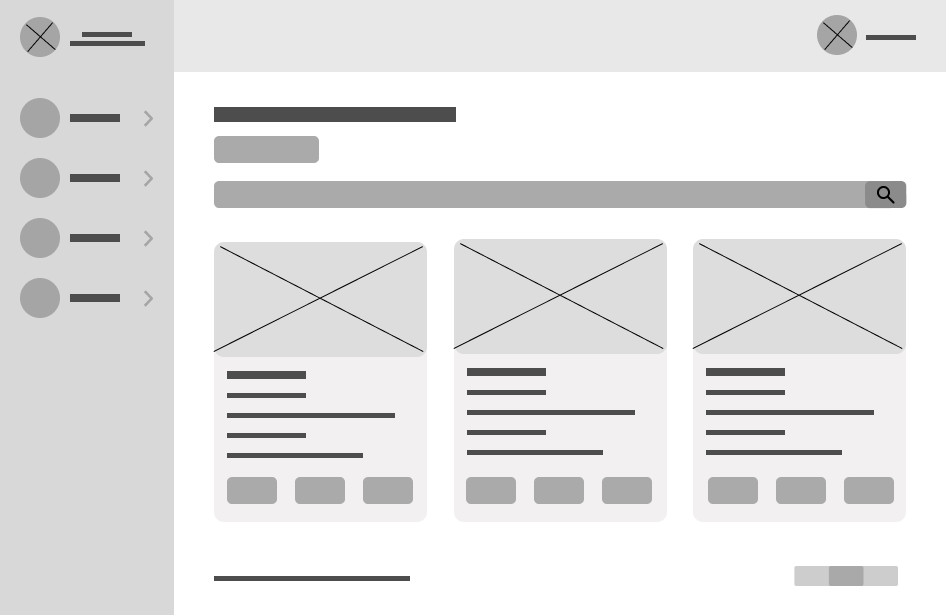
> Menampilkan koleksi buku dalam bentuk card: cover, judul, kode, pengarang, kategori, dan tombol aksi (detail, edit, hapus).  
> Dilengkapi tombol **Tambah Buku**, **Search Bar**, dan **Pagination**.

---

### 5. Tambah Buku
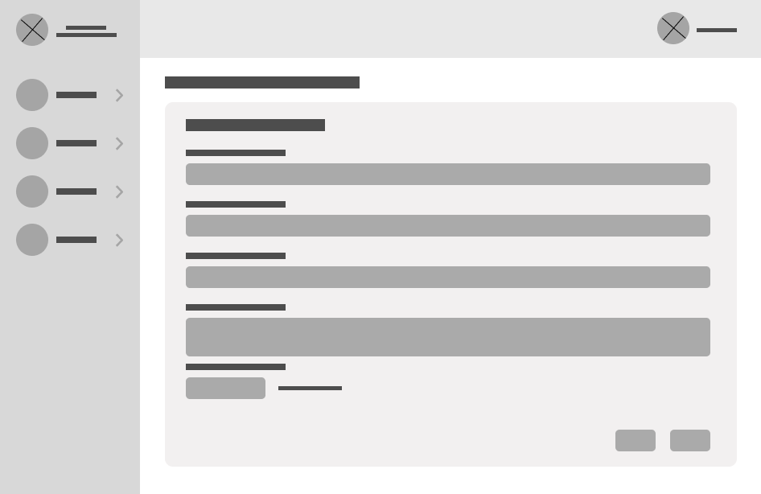
> Formulir penambahan buku baru.  
> Input: cover, judul, kode, pengarang, kategori, penerbit, tahun, deskripsi.  
> Tombol **Kembali** dan **Submit** disediakan di bawah form.

---

### 6. Daftar Kategori
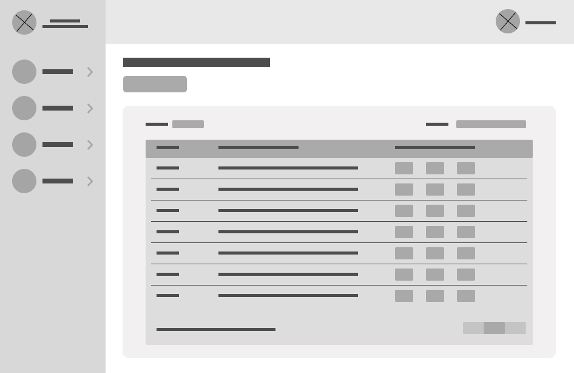
> Menampilkan tabel kategori buku (nama dan deskripsi).  
> Fitur: tombol **Tambah Kategori**, **Edit**, **Hapus**, dan **Search Bar**.

---

### 7. Tambah Kategori
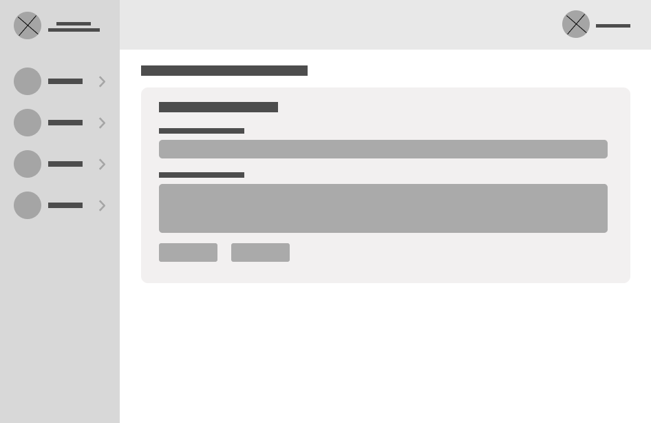
> Formulir untuk menambahkan kategori baru.  
> Input: nama kategori dan deskripsi.  
> Tombol **Kembali** dan **Submit**.

---

### 8. Detail Kategori
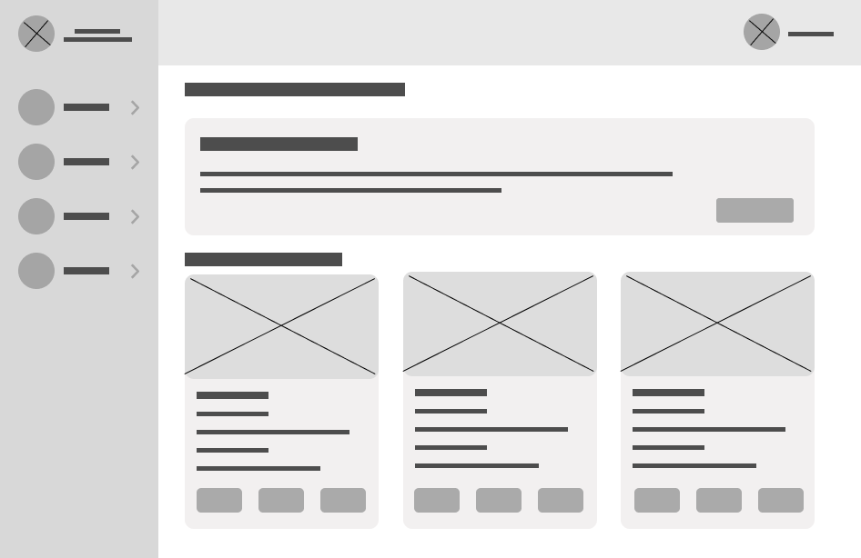
> Menampilkan kategori terpilih beserta daftar buku di dalamnya.  
> Tombol **Kembali** untuk kembali ke daftar kategori.

---

### 9. Daftar Anggota
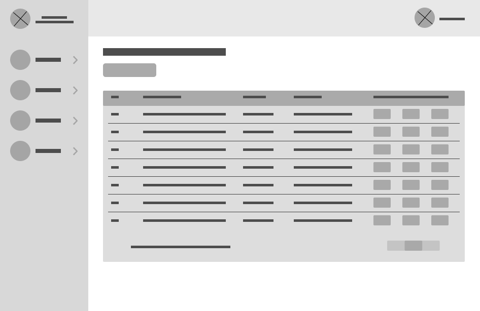
> Tabel anggota yang memuat nama, NPM, dan email.  
> Dilengkapi tombol **Tambah Anggota**, **Edit**, **Hapus**, dan **Pagination**.

---

### 10. Tambah Anggota
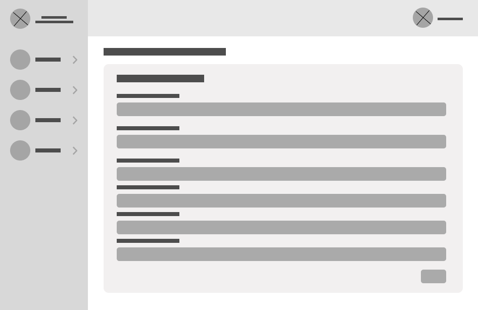
> Formulir penambahan anggota baru.  
> Input: Nama, NPM, Prodi, Alamat, Nomor Telepon, Email.  
> Tombol **Submit** untuk menyimpan anggota.

---

### 11. Edit Anggota
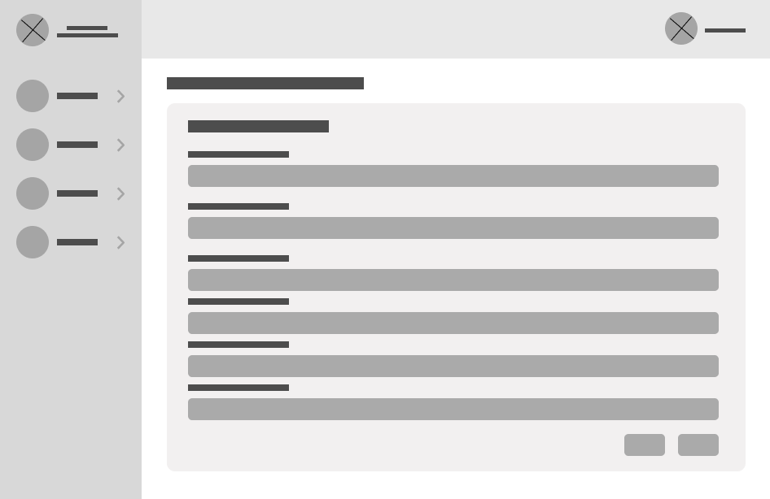
> Menampilkan data anggota untuk diperbarui.  
> Tombol **Kembali** dan **Submit** tersedia untuk menyimpan perubahan.

---

### 12. Riwayat Peminjaman Buku
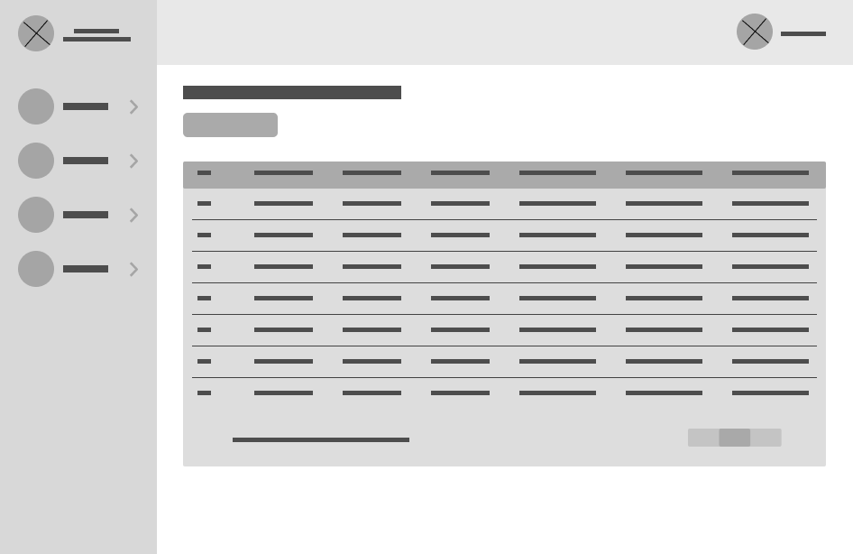
> Menampilkan daftar transaksi peminjaman buku.  
> Kolom: Nama peminjam, Judul buku, Kode, Tanggal pinjam, Tanggal wajib kembali, Tanggal pengembalian.  
> Tombol **Tambah Peminjaman**, **Search Bar**, dan **Pagination** tersedia.

---

### 13. Peminjaman Buku
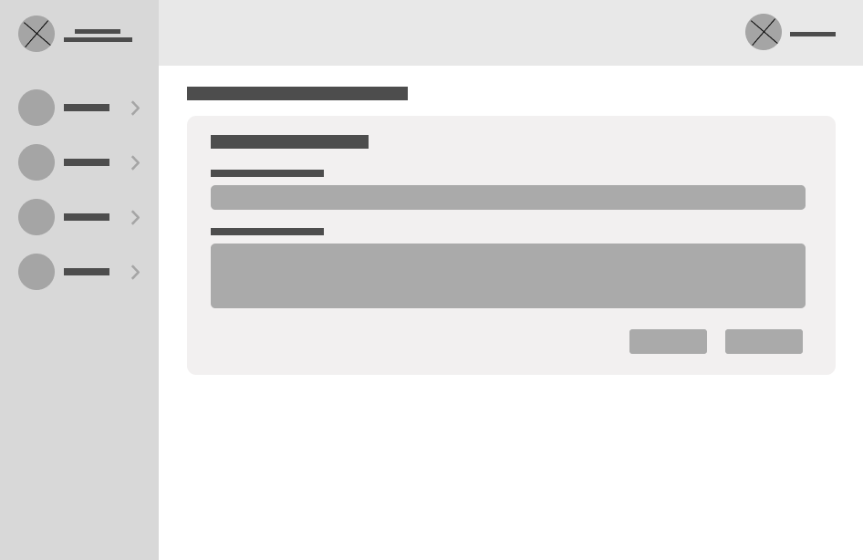
> Formulir menambahkan transaksi peminjaman baru.  
> Input: Nama Peminjam, Judul Buku, Tanggal Pinjam, Tanggal Kembali.  
> Tombol **Kembali** dan **Submit**.

---

### 14. Pengembalian Buku
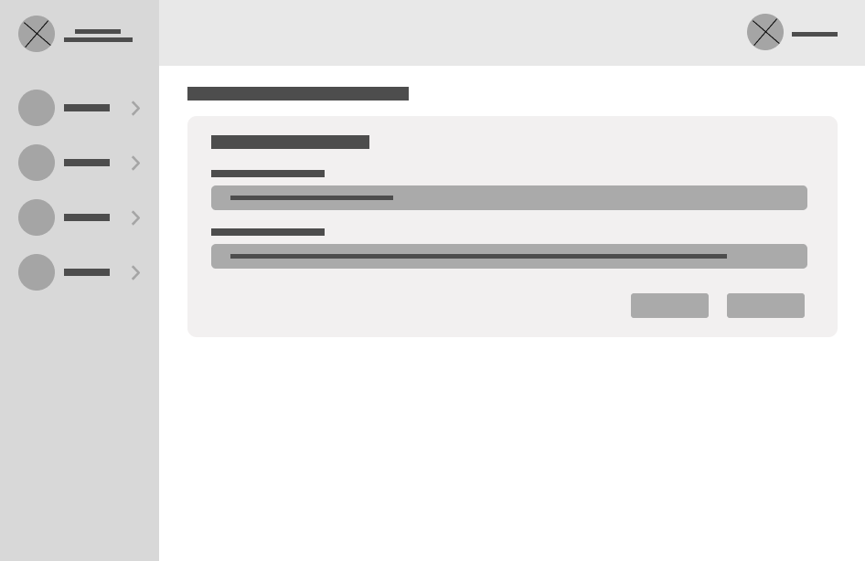
> Formulir pengembalian buku.  
> Input: Nama Peminjam, Judul Buku, Tanggal Pengembalian.  
> Tombol **Kembali** dan **Submit**.

---

### 15. Allert Berhasil

> Notifikasi bahwa aksi berhasil (misalnya penambahan buku, kategori, dll).

---

### 16. Allert Delete
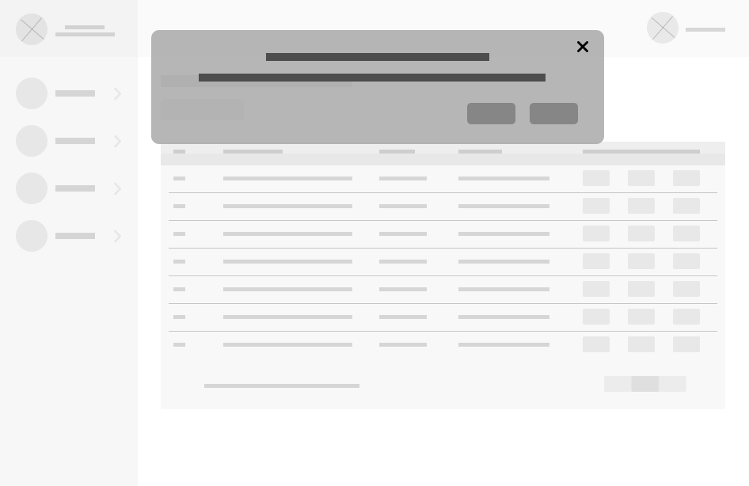
> Notifikasi konfirmasi sebelum penghapusan data.  
> Tombol **Cancel** untuk batal, **Delete** untuk menghapus data.

---

## 🗃️ Database Schema Design

---

### 1. **Tabel `user`**
| Kolom | Tipe Data | Keterangan |
|--------|------------|-------------|
| id | INT (PK) | Identitas unik pengguna |
| nama | VARCHAR | Nama pengguna |
| email | VARCHAR | Email login |
| password | VARCHAR | Kata sandi |
| isAdmin | BOOLEAN | 1 = Admin, 0 = User biasa |

**Relasi:**  
- 1 user → 1 profile (1–1)  
- 1 user → banyak riwayat_pinjam (1–M)

---

### 2. **Tabel `profile`**
| Kolom | Tipe Data | Keterangan |
|--------|------------|-------------|
| id | INT (PK) | ID profil |
| NIS | VARCHAR | Nomor induk siswa |
| angkatan | VARCHAR | Tahun angkatan |
| alamat | TEXT | Alamat |
| noTelp | VARCHAR | Nomor telepon |
| photo_profile | VARCHAR | Foto profil |
| user_iduser | INT (FK) | Relasi ke `user.id` |

---

### 3. **Tabel `buku`**
| Kolom | Tipe Data | Keterangan |
|--------|------------|-------------|
| id | INT (PK) | ID buku |
| judul | VARCHAR | Judul buku |
| gambar | VARCHAR | Cover |
| pengarang | VARCHAR | Nama penulis |
| deskripsi | TEXT | Sinopsis |
| penerbit | VARCHAR | Nama penerbit |
| tahun_terbit | YEAR | Tahun terbit |

---

### 4. **Tabel `kategori`**
| Kolom | Tipe Data | Keterangan |
|--------|------------|-------------|
| id | INT (PK) | ID kategori |
| nama_kategori | VARCHAR | Nama kategori (mis. Fiksi, Sains, Sejarah) |

---

### 5. **Tabel `kategori_buku`**
| Kolom | Tipe Data | Keterangan |
|--------|------------|-------------|
| kode_buku | INT (FK) | Relasi ke `buku.id` |
| kategori_id | INT (FK) | Relasi ke `kategori.id` |

**Relasi:**  
Many-to-Many (M–N) antara buku dan kategori.

---

### 6. **Tabel `riwayat_pinjam`**
| Kolom | Tipe Data | Keterangan |
|--------|------------|-------------|
| id | INT (PK) | ID transaksi |
| id_buku | INT (FK) | Relasi ke `buku.id` |
| tanggal_pinjam | DATE | Tanggal buku dipinjam |
| tanggal_wajib_kembali | DATE | Tanggal wajib kembali |
| tanggal_pengembalian | DATE | Tanggal buku dikembalikan |
| user_id | INT (FK) | Relasi ke `user.id` |

---

## 📈 ERD (Entity Relationship Diagram)

```mermaid
erDiagram
    %% Tabel profile
    profile {
        INT id
        VARCHAR(45) NIS
        VARCHAR(45) angkatan
        VARCHAR(45) alamat
        VARCHAR(45) noTelp
        VARCHAR(255) photo_profile
        INT user_iduser
    }

    %% Tabel user
    user {
        INT id
        VARCHAR(45) nama
        VARCHAR(45) email
        VARCHAR(45) password
        TINYINT isAdmin
    }

    %% Tabel admin
    admin {
        INT id
        VARCHAR(45) nama
        VARCHAR(45) email
        VARCHAR(45) password
    }

    %% Tabel riwayat_pinjam
    riwayat_pinjam {
        INT id
        INT id_buku
        DATE tanggal_pinjam
        DATE tanggal_wajib_kembali
        DATE tanggal_pengembalian
        INT user_id
    }

    %% Tabel buku
    buku {
        INT id
        VARCHAR(45) judul
        VARCHAR(45) gambar
        VARCHAR(45) pengarang
        TEXT deskripsi
        VARCHAR(45) penerbit
        VARCHAR(45) tahun_terbit
    }

    %% Tabel kategori
    kategori {
        INT id
        VARCHAR(45) nama_kategori
    }

    %% Tabel kategori_buku
    kategori_buku {
        INT kode_buku
        INT kategori_id
    }

    %% Relasi antar tabel
    profile ||--|| user : "1 to 1"
    user ||--o{ riwayat_pinjam : "1 to many"
    buku ||--o{ riwayat_pinjam : "1 to many"
    kategori ||--o{ kategori_buku : "1 to many"
    buku ||--o{ kategori_buku : "1 to many"